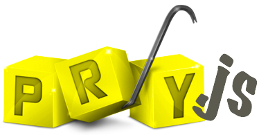

## Pry.js Examples

There is a [slideshow](http://www.slideshare.net/BlaineSch/pryjs-44754467) associated with this talk.

## REPL

REPL stands for: read, eval, print and loop.

## Alternatives

### JavaScript debugger [link](https://developer.mozilla.org/en-US/docs/Web/JavaScript/Reference/Statements/debugger)

This does not support server side debugging.

### Node Debugger [link](https://nodejs.org/api/debugger.html)

This does not stop the execution of your code, and gives no help in finding out
where you are, or what you can do.

### Node Inspector [link](https://github.com/node-inspector/node-inspector)

Amazing in-browser debugging of your code. It does not work well when you have
transcompilers like coffeescript, 6to5 or typescript.

## Running

~~~
node src/example.js
~~~

or

~~~
coffee src/example.coffee
~~~

## Adding Pry

~~~
npm install --save-dev pryjs
~~~
